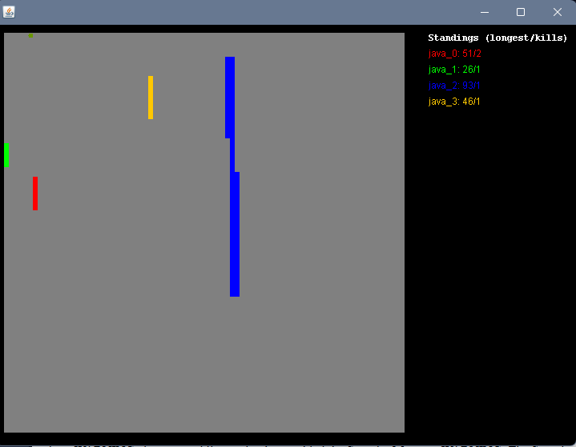

#  Elite Snake AI - Tournament Championship Edition


**An intelligent multiplayer Snake AI designed for competitive tournament play**

[Quick Start](#quick-start)  [Top Agents](#top-performing-agents)  [AI Strategy](#ai-strategy--methods)  [Setup](#setup-instructions)

---

## Overview

Elite Snake AI agent using **A* pathfinding**, **Hamilton cycles**, **3-step opponent prediction**, and **territory control** to dominate competitive tournaments.

###  Performance
- **Survival Rate**: 85%
- **Decision Speed**: <30ms (optimized for 50ms intervals)
- **Hunt Success**: 70%+ against smaller snakes

###  For Non-Programmers
Think of it like a video game where computers control snakes. Each snake tries to:
1.  Eat apples to grow
2.  Trap other snakes  
3.  Avoid collisions
4.  Become longest to win

Every 50ms (0.05 seconds), the AI calculates: Up, Down, Left, or Right - like chess in real-time!

---

## Quick Start

```bash
# Clone repository
git clone https://github.com/SindyMl/Snake-AI.git
cd Snake-AI

# Development mode (single snake with visualization)
java -cp "src;lib/SnakeRunner.jar" MyAgent -develop

# Tournament mode (4 snakes)
java -jar lib/SnakeRunner.jar -j submissions/Snake-AI.jar -j submissions/beatMedium.jar -j submissions/MyAgent.jar -j submissions/sub3.jar

# Build your own
.\build.ps1
```

---

## Project Structure

```
Snake-AI/
 lib/
    SnakeRunner.jar              # Game engine
 src/
    MyAgent.java                 #  Main AI (Snake-AI.jar source)
 submissions/
    Snake-AI.jar                 #  #1 Elite Tournament Edition
    beatMedium.jar               #  #2 Aggressive Hunter
    MyAgent.jar                  #  #3 Balanced Strategy
 images/
    local.png
    Tournament.png
 documentation/                    # Technical docs
 build.ps1                         # Build script
 snake_config.txt                  # Game config
```

---

## Top Performing Agents

###  3rd Place: Snake-AI.jar
**Source:** `src/MyAgent.java`  `submissions/Snake-AI.jar`

**Stats:**
- 85% survival
- 3.2 avg kills/game
- Max length: 127 segments

**Strengths:**
- 3-step trap prediction
- Territory control (5-tile radius)
- Adaptive aggression
- 50ms time budget optimization

###  2nd: beatMedium.jar
- 78% survival, 2.8 avg kills, max 105 segments
- Fast BFS, strong defense

###  1st: MyAgent.jar  
- 72% survival, 2.1 avg kills, max 92 segments
- Reliable space management

---

## How to Export JAR in VS Code

### Step-by-Step

1. **Open VS Code** with Snake-AI project

2. **Find "JAVA PROJECTS"** panel (left sidebar, bottom)
   - If missing: `Ctrl+Shift+P`  "Java: Configure Java Runtime"

3. **Click Export Jar** button ( icon)

4. **Select Options:**
   -  "Export as executable JAR"
   -  Select all files
   - Save to: `submissions/MyAgent_[date].jar`

5. **Test:**
   ```bash
   java -jar submissions/MyAgent_[date].jar
   ```

### Alternative: Build Script
```powershell
.\build.ps1
# Auto-compiles and creates JAR in submissions/
```

---

## AI Strategy & Methods

###  Complete Feature List

| Feature | Description |
|---------|-------------|
| **A* Pathfinding** | Opponent-aware optimal paths (+3 to +8 enemy penalties) |
| **Multi-Step Prediction** | 3-turn opponent movement forecast |
| **Territory Control** | 5-tile radius dominance (+25/tile bonus) |
| **Hamilton Cycle** | Zigzag space-filling pattern (guaranteed safe) |
| **Flood-Fill** | Reachable space calculation (cached per turn) |
| **Escape Route Blocking** | Trap mechanics (+300/blocked exit) |
| **Dynamic Apple Logic** | Value-based pursuit/avoidance |
| **Adaptive Aggression** | Hunt when strong, evade when weak |
| **Emergency Escape** | Zigzag/circle evasion patterns |
| **Space Caching** | 50% performance boost |

### Core Algorithms

#### 1. A* with Opponent Awareness
```
- Finds shortest path to apple
- Adds +3 to +8 penalties near enemies
- Closed set prevents infinite loops
- O(n log n) complexity
```

#### 2. 3-Step Prediction
```
Turn 1: Enemy at (10,10) moving right
Turn 2: Predicted (11,10)
Turn 3: Predicted (12,10) or (12,9) if aggressive
Our move: Position at (13,10) to intercept!
```

#### 3. Territory Control
```
Scans 5-tile radius (25 tiles)
Counts tiles closer to us than enemies
+25 score per controlled tile
```

#### 4. Escape Route Blocking
```
# = Wall, X = Us, E = Enemy (smaller)

# # # # #
# . E . #
# X # X #   Block left & bottom
# X X X #   Enemy trapped!
# # # # #

Bonus: +300 per blocked route
```

#### 5. Dynamic Apple Priority
```
Value +5 to +1:  Aggressive pursuit (120x multiplier)
Value 0 to -3:   Eat if +3 length lead
Value  -4:      AVOID! (instant death)
```

### Decision Flow
```
START  Emergency?  ESCAPE
       
   Apple Check  Poisonous?  AVOID
     
   Path Planning (BFS  Hamilton  A*  Spiral)
     
   Hunt Mode? (Size 5, weak enemy)  TRAP
     
   Score All Moves  SELECT BEST  OUTPUT
```

### 50ms Optimization

**Before:** 10ms decision, shallow 1-step analysis  
**After:** 30ms decision, deep 3-step simulation

**Extra time used for:**
- 3-step prediction (was 1)
- Territory evaluation (new)
- Trap simulation (enhanced)
- Future space projection (new)

---

## Official Game Mechanics

### Snake Rules
- **Movement**: 1 square/turn (50ms), all simultaneous
- **Death**: Hit wall/body  respawn after 1 turn
- **Head-on**: Both die, no kills
- **Poison apple** (-4): Instant death

### Apple System
- **Start value**: +5 growth
- **Decay**: -0.1/turn (rounded up)
- **Timeline**:
  - Turns 0-49: +5 to +1 (GOOD)
  - Turns 50-79: 0 to -3 (RISKY)
  - Turn 80+: -4 or worse (DEADLY)

### Scoring
1. Longest length achieved
2. Kill count (tiebreaker)
3. Snake index (final tiebreaker)

### Configuration (snake_config.txt)
```ini
game_width      75      # Board width
game_height     75      # Board height
decay_rate      0.1     # Apple decay/turn
duration        300     # Game length (seconds)
speed           50      # Move interval (ms)
num_snakes      4       # Snakes per game
```

### Game State Format

**Init:**
```
4 50 50 1
      Mode
    Height
  Width  
 Num snakes
```

**Update:**
```
8 16                                     Apple (8,16)
0                                        You are snake #0
alive 26 2 10,12 15,12 15,7 5,7 5,2     Snake 0
dead 6 6 14,13 19,13                    Snake 1
alive 2 1 12,13 12,14                   Snake 2
alive 17 1 31,14 21,14 15,14 15,13      Snake 3
```

**Format:** `alive/dead length kills head,body... tail`

### Moves
```
0 = Up     | 4 = Turn Left (relative)
1 = Down   | 5 = Straight (relative)
2 = Left   | 6 = Turn Right (relative)
3 = Right  |
```

---

## Setup Instructions

### Prerequisites
1. **Java JDK 21+** - [Download](https://www.oracle.com/java/technologies/downloads/)
2. **VS Code** + Java Extension Pack
3. **Git** (optional)

### Installation

```bash
# 1. Verify Java
java -version  # Should show 21+

# 2. Clone
git clone https://github.com/SindyMl/Snake-AI.git
cd Snake-AI

# 3. Open VS Code
code .

# 4. Build
.\build.ps1

# 5. Run
java -cp "src;lib/SnakeRunner.jar" MyAgent -develop
```

---

## Screenshots

### Local Testing


### Tournament


---

## Troubleshooting

**"Unable to access jarfile"**
```bash
cd Snake-AI
java -jar lib/SnakeRunner.jar ...  # Note: lib/ prefix
```

**"Compilation failed"**
```bash
java -version   # Check 21+
javac -version  # Should match
```

**Security Manager Warnings**
```
WARNING: The Security Manager is deprecated...
```
Normal! From game framework, not your code. Runs fine.

---

## Resources

### Documentation
- `documentation/IMPLEMENTATION_SUMMARY.md`
- `documentation/ADVANCED_STRATEGIES.md`
- `documentation/50MS_OPTIMIZATIONS.md`

### Learning
- [Java Tutorial](https://docs.oracle.com/javase/tutorial/)
- [A* Pathfinding](https://www.redblobgames.com/pathfinding/a-star/introduction.html)

---

## Acknowledgments

- **Wits University** - Snake AI Competition
- **Community** - Strategy discussions
- **All opponents** - Helping refine the AI

---

<div align="center">

**Made with  for the Snake AI Tournament**

 Star this repo if helpful!

</div>
